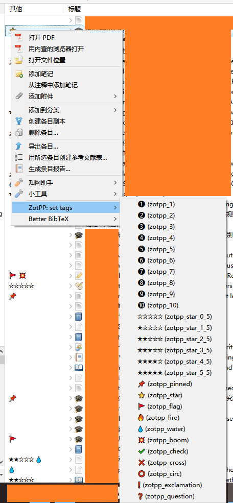
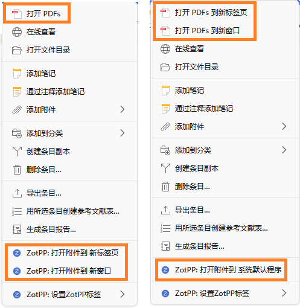

# Zot Plus Plus


## Introduction
Zotero++ (ZotPP), an enhancement plugin to [Zotero](https://www.zotero.org/).

> [!NOTE]
> Zotero 7 compatible. (Zotero 6 bootstrap branch has archived)

## Screenshots
<details>
  <summary>ZotPP tags</summary>
  <!--  -->
  
</details>
<details>
  <summary>open attachment in other methods</summary>
  <!--  -->
  
</details>

## Features
- ZotPP tags: (inspired from [zotero-special-tags-column](https://github.com/whacked/zotero-special-tags-column)):
  - [x] Independent `ZotPP tags` column with configurable emojis.
  - [x] Right click to add/remove self-defined tags to rate items with stars, mark items as unread/read, indicate feelings for items, etc..
- [x] Right click on item to open with selected method that other than the default method in the preference pane. (inspired from [zotero-open-pdf](https://github.com/retorquere/zotero-open-pdf))
- [ ] Right click on item to auto-rename attachments.
- [ ] TBD ...

## Appendix: Default ZotPP tags
After the installation of the plugin, this ZotPP tags json map with emojis is the default value in the preference pane.

> [!TIP]
> Keeping the `zotpp_` prefix in the tag name for identification is highly recommended.

```json
{
    "zotpp_1": "❶",
    "zotpp_2": "❷",
    "zotpp_3": "❸",
    "zotpp_4": "❹",
    "zotpp_5": "❺",
    "zotpp_6": "❻",
    "zotpp_7": "❼",
    "zotpp_8": "❽",
    "zotpp_9": "❾",
    "zotpp_10": "❿",

    "zotpp_star_0_5": "☆☆☆☆☆",
    "zotpp_star_1_5": "★☆☆☆☆",
    "zotpp_star_2_5": "★★☆☆☆",
    "zotpp_star_3_5": "★★★☆☆",
    "zotpp_star_4_5": "★★★★☆",
    "zotpp_star_5_5": "★★★★★",

    "zotpp_pinned": "📌",
    "zotpp_star": "⭐",
    "zotpp_flag": "🚩",

    "zotpp_fire": "🔥",
    "zotpp_water": "💧",
    "zotpp_boom": "💥",
    "zotpp_check": "✔️",
    "zotpp_cross": "❌",
    "zotpp_circ": "⭕",
    "zotpp_exclamation": "❗",
    "zotpp_question": "❓"
}
```
