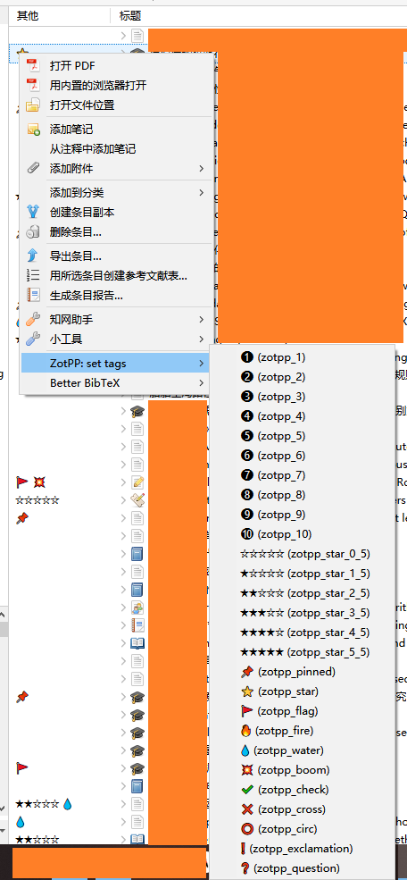
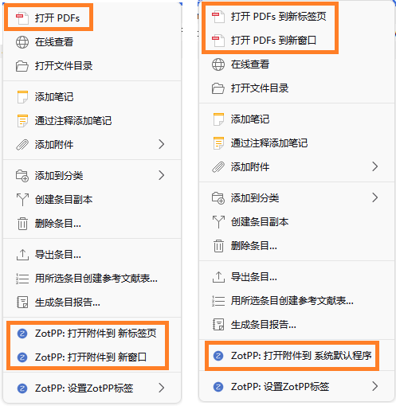

# Zot Plus Plus

[](https://www.zotero.org)
[](https://github.com/windingwind/zotero-plugin-template)

[English](README.md) | [简体中文](doc/README-zhCN.md)

## Introduction

Zotero++ (ZotPP), an enhancement plugin to [Zotero](https://www.zotero.org/).

> [!NOTE]
> Zotero 8 and 9 compatible (historical version branches have been archived).

## Screenshots

<details>
  <summary>ZotPP tags</summary>
  <!--  -->
  
</details>
<details>
  <summary>open attachment in other methods</summary>
  <!--  -->
  
</details>

## Features

- [x] ZotPP tags: (inspired from [zotero-special-tags-column](https://github.com/whacked/zotero-special-tags-column)):
  - [x] Independent `ZotPP tags` column with configurable emojis.
  - [x] Right click to add/remove self-defined tags to rate items with stars, mark items as unread/read, indicate feelings for items, etc..
- [x] Right click on item to open with selected method that other than the default method in the preference pane. (inspired from [zotero-open-pdf](https://github.com/retorquere/zotero-open-pdf))
- [x] ~~Right click on item to auto-rename attachments.~~ (builtin [continuous file renaming from Zotero 8](https://www.zotero.org/support/8.0_changelog#changes_in_80_january_22_2026))
- [ ] Column of related items number.
- [ ] Select and right-click to relate several items. (inspired from [Zutilo](https://github.com/wshanks/Zutilo))
- [ ] TBD ...

## Appendix: Default ZotPP tags

After the installation of the plugin, this ZotPP tags json map with emojis is the default value in the preference pane.

> [!TIP]
> Keeping the `zotpp_` prefix in the tag name for identification is highly recommended.

```json
{
  "zotpp_1": "❶",
  "zotpp_2": "❷",
  "zotpp_3": "❸",
  "zotpp_4": "❹",
  "zotpp_5": "❺",
  "zotpp_6": "❻",
  "zotpp_7": "❼",
  "zotpp_8": "❽",
  "zotpp_9": "❾",
  "zotpp_10": "❿",

  "zotpp_star_0_5": "☆☆☆☆☆",
  "zotpp_star_1_5": "★☆☆☆☆",
  "zotpp_star_2_5": "★★☆☆☆",
  "zotpp_star_3_5": "★★★☆☆",
  "zotpp_star_4_5": "★★★★☆",
  "zotpp_star_5_5": "★★★★★",

  "zotpp_pinned": "📌",
  "zotpp_star": "⭐",
  "zotpp_flag": "🚩",

  "zotpp_fire": "🔥",
  "zotpp_water": "💧",
  "zotpp_boom": "💥",
  "zotpp_check": "✔️",
  "zotpp_cross": "❌",
  "zotpp_circ": "⭕",
  "zotpp_exclamation": "❗",
  "zotpp_question": "❓"
}
```
