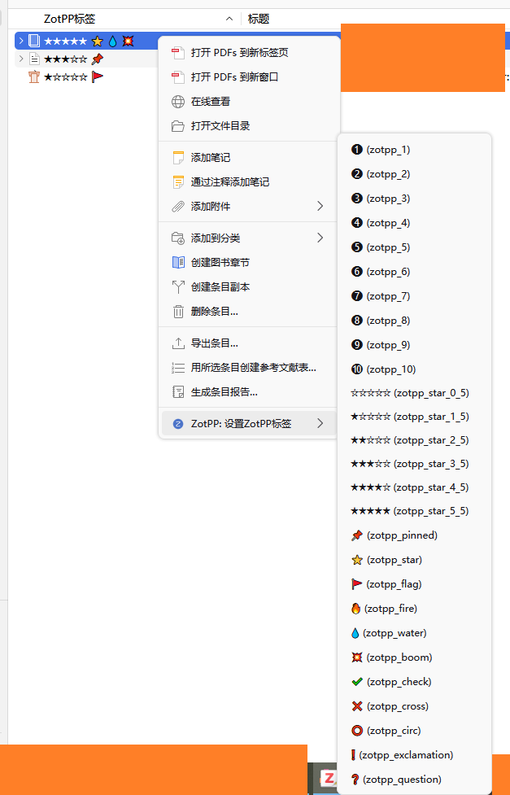

# Zot Plus Plus

## Introduction
Zotero++ (ZotPP), an enhancement plugin to [Zotero](https://www.zotero.org/).

Zotero 7 compatible. (Zotero 6 bootstrap branch archived)



## Features
- [ ] TBD
> Inspired from [zotero-special-tags-column](https://github.com/whacked/zotero-special-tags-column):
> - [ ] Rate items with stars in extra columns using defined tags
> - [ ] Mark items as unread/read in extra columns using defined tags

## Appendix: ZotPP tags
After the installation of the plugin, paste this json manually in the preference pane to correct the emojis.
```json
{
    "zotpp_1": "❶",
    "zotpp_2": "❷",
    "zotpp_3": "❸",
    "zotpp_4": "❹",
    "zotpp_5": "❺",
    "zotpp_6": "❻",
    "zotpp_7": "❼",
    "zotpp_8": "❽",
    "zotpp_9": "❾",
    "zotpp_10": "❿",

    "zotpp_star_0_5": "☆☆☆☆☆",
    "zotpp_star_1_5": "★☆☆☆☆",
    "zotpp_star_2_5": "★★☆☆☆",
    "zotpp_star_3_5": "★★★☆☆",
    "zotpp_star_4_5": "★★★★☆",
    "zotpp_star_5_5": "★★★★★",

    "zotpp_pinned": "📌",
    "zotpp_star": "⭐",
    "zotpp_flag": "🚩",

    "zotpp_fire": "🔥",
    "zotpp_water": "💧",
    "zotpp_boom": "💥",
    "zotpp_check": "✔️",
    "zotpp_cross": "❌",
    "zotpp_circ": "⭕",
    "zotpp_exclamation": "❗",
    "zotpp_question": "❓"
}
```
